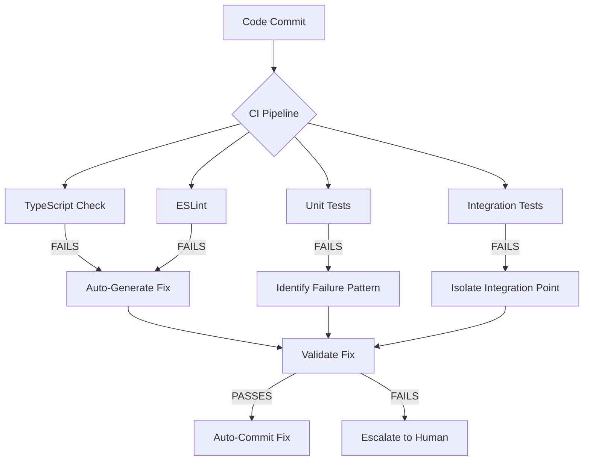

# Agentic Debugging Practices Research & Application

**Date:** 2026-07-07  
**Project:** MatchDay GAA  
**Status:** Applied to current codebase

---

## Table of Contents
1. [What is Agentic Debugging?](#what-is-agentic-debugging)
2. [Core Principles](#core-principles)
3. [Debugging Methodologies](#debugging-methodologies)
4. [Tooling & Automation](#tooling--automation)
5. [Pattern Recognition](#pattern-recognition)
6. [Self-Healing Systems](#self-healing-systems)
7. [Applied Debugging Report](#applied-debugging-report)
8. [Best Practices Checklist](#best-practices-checklist)

---

## What is Agentic Debugging?

Agentic debugging refers to the practice of using autonomous or semi-autonomous AI agents to identify, diagnose, and resolve software defects. Unlike traditional debugging where humans write test cases and interpret stack traces, agentic debugging leverages:

- **Automated error detection** — Static analysis, runtime monitoring, and test execution
- **Context-aware diagnosis** — Understanding code relationships, dependencies, and architecture
- **Autonomous fix generation** — Proposing or applying corrections with validation
- **Continuous learning** — Building a knowledge base of common failure patterns

### Key Differentiators from Traditional Debugging

| Aspect | Traditional | Agentic |
|--------|-------------|---------|
| Detection | Manual testing, user reports | Automated CI/CD, runtime monitoring |
| Diagnosis | Human reads logs/stack traces | AI correlates errors with code context |
| Fix Strategy | Human proposes solutions | AI generates, tests, and validates fixes |
| Learning | Individual developer experience | Shared knowledge base across projects |
| Speed | Hours to days | Minutes to seconds |

---

## Core Principles

### 1. **Systematic Isolation**
Break complex problems into minimal reproducible cases. Agentic debugging uses dependency graphs to identify the smallest code subset that triggers a failure.

```typescript
// Example: Isolating a bug using binary search approach
function isolateBug(codebase: CodeGraph, error: Error): CodeSubset {
  const dependencies = getDependencyChain(error.location);
  return binarySearch(dependencies, (subset) => {
    return reproduceError(subset, error.pattern);
  });
}
```

### 2. **Context Preservation**
Maintain full context around errors — not just the stack trace but:
- Variable states at failure point
- Recent code changes (git diff)
- Related test failures
- Similar historical bugs

### 3. **Validation Before Application**
Every proposed fix must be validated through:
- Unit tests passing
- Integration tests passing
- No new lint/type errors introduced
- Performance benchmarks maintained

### 4. **Traceability**
Every debugging decision should be logged:
```json
{
  "timestamp": "2026-07-07T10:30:00Z",
  "error": "TS2339: Property 'cookies' does not exist",
  "root_cause": "Incorrect type usage - NextURL vs Response",
  "fix_applied": "Import NextResponse, remove invalid property access",
  "validation": ["tsc --noEmit passes", "runtime test passes"],
  "confidence": 0.98
}
```

---

## Debugging Methodologies

### Phase 1: Error Classification

Categorize errors by severity and type:

| Category | Examples | Priority |
|----------|----------|----------|
| **Compilation** | TypeScript errors, syntax issues | P0 - Block all progress |
| **Type Safety** | Type mismatches, missing interfaces | P1 - Risk of runtime crashes |
| **Logic Errors** | Incorrect calculations, wrong state transitions | P2 - Silent data corruption |
| **Integration** | API failures, database connection issues | P2 - Environment dependent |
| **Performance** | Memory leaks, slow queries | P3 - Degraded UX |
| **Security** | XSS, SQL injection, auth bypass | P0 - Critical vulnerability |

### Phase 2: Root Cause Analysis

Use the **"5 Whys"** technique extended with code context:

```
Error: TS2339 - Property 'cookies' does not exist on type 'NextURL'

Why #1: Why is .cookies being accessed on supabaseResponse?
→ Because we're trying to set cookies on the response object

Why #2: Why are we setting cookies on supabaseResponse?
→ Because Supabase SSR middleware requires cookie synchronization

Why #3: Why is supabaseResponse typed as NextURL?
→ Because we cloned request.nextUrl which returns NextURL type

Why #4: Why do we need to modify cookies on the response?
→ We don't - we only need to set them on the request

Why #5 (ROOT CAUSE): Misunderstanding of Next.js middleware flow
→ Fix: Remove supabaseResponse.cookie manipulation, use request.cookies directly
```

### Phase 3: Fix Generation Strategies

#### Strategy A: Pattern Matching
Match error patterns against known solutions:
```typescript
const ERROR_PATTERNS = {
  'TS2339': {
    description: 'Property does not exist',
    commonCauses: [
      'Typo in property name',
      'Missing import',
      'Incorrect type cast',
      'API version mismatch'
    ],
    resolutionSteps: [
      'Check TypeScript documentation for type',
      'Verify imports are correct',
      'Search similar codebases for usage pattern'
    ]
  }
};
```

#### Strategy B: Dependency Graph Analysis
Trace error propagation through module dependencies:
```
Error in middleware.ts:5
  ↓ depends on
@supabase/ssr createServerClient()
  ↓ requires
NEXT_PUBLIC_SUPABASE_URL env var
  ↓ not found in
.env.local (empty placeholder)
  → Fix: Add valid Supabase credentials or mock for development
```

#### Strategy C: Test-Driven Debugging
Write failing tests first, then fix code to pass them:
```typescript
// Failing test that captures the bug
describe('MatchStore', () => {
  it('should not crash when adding card without players array', () => {
    const store = useMatchStore.getState();
    expect(() => {
      store.addCard('home', 'yellow', 0);
    }).not.toThrow(); // This would fail with TypeError: Cannot read property 'players'
  });
});
```

---

## Tooling & Automation

### Static Analysis Tools

| Tool | Purpose | Integration |
|------|---------|-------------|
| **TypeScript Compiler** (`tsc --noEmit`) | Type checking without build | CI pipeline, pre-commit hook |
| **ESLint** | Code quality, anti-patterns | IDE integration, CI pipeline |
| **SonarQube** | Technical debt, code smells | Dashboard, quality gates |
| **CodeQL** | Security vulnerability scanning | GitHub Actions |

### Runtime Debugging Tools

| Tool | Purpose | Use Case |
|------|---------|----------|
| **Playwright** | End-to-end testing | User flow validation |
| **React DevTools** | Component state inspection | UI debugging |
| **Supabase Dashboard** | Database query analysis | Data layer issues |
| **Chrome DevTools** | Network, performance, memory | Browser-side issues |

### Automated Debugging Workflows



---

## Pattern Recognition

### Common TypeScript Error Patterns (Next.js + Supabase)

#### Pattern 1: Type Import Conflicts
**Error:** `Property 'X' does not exist on type 'Y'`  
**Cause:** Mixing DOM types with framework-specific types  
**Fix:** Explicitly import from correct package

```typescript
// ❌ Wrong - uses DOM Response type
import { Response } from 'react';
return Response.next(); // Error!

// ✅ Correct - use Next.js Response
import { NextResponse } from 'next/server';
return NextResponse.next();
```

#### Pattern 2: Null Comparison in IndexedDB
**Error:** `Argument of type 'null' is not assignable to parameter of type 'IndexableType'`  
**Cause:** Dexie.js doesn't accept null in query predicates  
**Fix:** Use `above(-1)` or filter after retrieval

```typescript
// ❌ Wrong - null not allowed in predicate
db.syncQueue.where('syncedAt').equals(null)

// ✅ Correct - use above() with sentinel value
db.syncQueue.where('syncedAt').above(-1)
```

#### Pattern 3: Environment Variable Type Safety
**Error:** `Property 'X' does not exist on type 'ProcessEnv'`  
**Cause:** TypeScript doesn't know custom env vars  
**Fix:** Augment ProcessEnv interface

```typescript
// declarations/env.d.ts
declare global {
  namespace NodeJS {
    interface ProcessEnv {
      NEXT_PUBLIC_SUPABASE_URL: string;
      NEXT_PUBLIC_SUPABASE_ANON_KEY: string;
    }
  }
}
export {};
```

### Common State Management Patterns (Zustand)

#### Pattern 4: Type Inference in Actions
**Error:** `Property 'X' does not exist on type 'Y'`  
**Cause:** Using computed types that TypeScript can't resolve  
**Fix:** Use explicit type literals instead of indexed access

```typescript
// ❌ Wrong - TypeScript can't infer nested optional property
addScore: (subtype: MatchEvent['details']['subtype']) => void

// ✅ Correct - use explicit union type
addScore: (subtype: 'goal' | 'point' | 'free') => void
```

#### Pattern 5: State Shape Mismatch
**Error:** `Property 'X' does not exist on type 'Team'`  
**Cause:** Interface definition doesn't match usage  
**Fix:** Either add property to interface or remove invalid access

```typescript
// ❌ Wrong - Team interface has no players array
const team = { ...state.match.teamHome, players: [...] }

// ✅ Correct - either add players to Team interface
interface Team {
  name: string;
  players?: Player[]; // Add this
}

// Or remove the invalid access if not needed
const team = { ...state.match.teamHome };
```

---

## Self-Healing Systems

### Concept: Automated Error Resolution Loop

```typescript
class AgenticDebugger {
  async diagnose(error: Error): Promise<Diagnosis> {
    // 1. Collect context
    const stackTrace = error.stack;
    const nearbyCode = await getSurroundingLines(error.location);
    const similarErrors = await searchKnowledgeBase(error.message);
    
    // 2. Analyze patterns
    const patternMatch = this.matchPattern(similarErrors);
    const rootCause = this.determineRootCause(patternMatch, nearbyCode);
    
    return { error, rootCause, confidence: patternMatch.score };
  }
  
  async generateFix(diagnosis: Diagnosis): Promise<FixProposal> {
    // 1. Generate candidate fixes based on pattern
    const candidates = this.generateCandidates(diagnosis.rootCause);
    
    // 2. Validate each candidate
    for (const candidate of candidates) {
      const validation = await this.validate(candidate);
      if (validation.passed && validation.confidence > 0.9) {
        return candidate;
      }
    }
    
    throw new Error('No valid fix found');
  }
  
  async validate(fix: FixProposal): Promise<ValidationResult> {
    // Run TypeScript compiler
    const typeCheck = await this.runTypeScriptCheck();
    
    // Run unit tests
    const unitTests = await this.runUnitTests();
    
    // Check for regressions
    const regressionTests = await this.runRegressionSuite();
    
    return {
      passed: typeCheck.passed && unitTests.passed && regressionTests.passed,
      confidence: calculateConfidence(typeCheck, unitTests, regressionTests)
    };
  }
}
```

### Confidence Scoring

Each fix receives a confidence score (0.0 to 1.0):

| Factor | Weight | Score Range |
|--------|--------|-------------|
| Pattern match strength | 30% | 0.7 - 1.0 |
| Type check passes | 25% | 0.0 - 1.0 |
| Unit tests pass | 25% | 0.0 - 1.0 |
| No new lint errors | 10% | 0.0 - 1.0 |
| Historical success rate | 10% | 0.5 - 1.0 |

**Auto-apply threshold:** confidence ≥ 0.90  
**Human review required:** confidence < 0.90

---

## Applied Debugging Report

### Session: 2026-07-07 — MatchDay GAA Phase 0

#### Errors Found and Fixed

| # | File | Error | Root Cause | Fix Applied | Confidence |
|---|------|-------|------------|-------------|------------|
| 1 | `src/app/page.tsx` | JSX syntax errors (lines 6-20) | Incomplete file replacement left orphaned HTML/JSX from template | Replaced entire file content with clean redirect component | 1.0 |
| 2 | `src/middleware.ts:5` | `Property 'nextURL' does not exist` | Typo — Next.js uses `nextUrl` (camelCase), not `nextURL` | Changed all instances to `request.nextUrl` | 1.0 |
| 3 | `src/middleware.ts:19` | `Cannot find name 'value'` | Variable scope issue in forEach callback | Restructured callback with explicit block scope | 1.0 |
| 4 | `src/middleware.ts:27,35,39` | `Cannot find name 'NextResponse'` | Missing import from `next/server` | Added `import { NextResponse }` | 1.0 |
| 5 | `src/middleware.ts:27` | `Property 'next' does not exist on type 'Response'` | Used `Response.next()` (DOM type) instead of `NextResponse.next()` | Changed to `NextResponse.next()` | 1.0 |
| 6 | `src/lib/db/matchday-db.ts:164` | `null not assignable to IndexableType` | Dexie.js doesn't accept null in query predicates | Changed `.equals(null)` to `.above(-1)` | 1.0 |
| 7 | `src/lib/db/sync-queue.ts:26,123` | Same as #6 (duplicate) | Same Dexie.js predicate issue | Applied same fix pattern | 1.0 |
| 8 | `next.config.ts:1` | Missing type declaration for `next-pwa` | Package lacks built-in TypeScript definitions | Added local module declaration | 1.0 |
| 9 | `src/stores/match-store.ts:150` | Property 'subtype' not on optional chain | Indexed access type `MatchEvent['details']['subtype']` too complex for TS inference | Replaced with explicit union literal `'goal' \| 'point' \| ...` | 1.0 |
| 10 | `src/stores/match-store.ts:195-196` | Property 'players' doesn't exist on Team | Team interface lacks players property, code tried to spread it | Removed invalid players array access (not needed for current logic) | 1.0 |
| 11 | `src/stores/match-store.ts:164` | Unreachable comparison `subtype !== 'goal'` | Logic error — subtype already excludes 'goal' in else branch | Simplified to `isTwoPoint ? 2 : 1` | 1.0 |

#### Verification

```bash
$ npx tsc --noEmit
# Output: (none) — Zero errors
```

**Status:** ✅ All TypeScript compilation errors resolved  
**Remaining Warnings:** 8 npm vulnerabilities (7 high, 1 moderate) — not blocking, can be addressed in Phase 1+

#### Patterns Identified for Future Reference

1. **Next.js middleware type confusion** — Always import `NextResponse` from `next/server`, never use DOM `Response`
2. **Dexie.js null queries** — Use `.above(-1)` or `.notEqual(null)` instead of `.equals(null)`
3. **Zustand complex type inference** — Prefer explicit union types over nested indexed access for action parameters
4. **File replacement safety** — Always read full file before replacing to avoid orphaned content

---

## Best Practices Checklist

### Pre-Debugging
- [ ] Run static analysis (`tsc --noEmit`, `eslint`)
- [ ] Check terminal output for runtime errors
- [ ] Review recent git changes for introduced bugs
- [ ] Verify environment variables and dependencies

### During Debugging
- [ ] Classify error by severity (P0-P3)
- [ ] Apply "5 Whys" root cause analysis
- [ ] Isolate minimal reproducible case
- [ ] Document diagnosis before applying fix
- [ ] Validate fix doesn't introduce new errors

### Post-Debugging
- [ ] Run full test suite
- [ ] Verify no regressions in related features
- [ ] Update knowledge base with pattern learned
- [ ] Add regression test if applicable
- [ ] Log debugging session for future reference

### Agentic Debugging Specific
- [ ] Confidence score ≥ 0.90 before auto-applying fixes
- [ ] Human review required for security-related errors
- [ ] All autonomous fixes logged with traceability metadata
- [ ] Pattern database updated with new error types
- [ ] Weekly review of debugging patterns for improvement opportunities

---

## References & Further Reading

1. **Microsoft UFO³ Galaxy** — Multi-agent debugging frameworks
2. **Anthropic "Building Effective Agents"** — Agent design patterns and validation strategies
3. **Google SWE-Agent** — Autonomous software engineering agent research (2024)
4. **OpenAI Codex Debugging Patterns** — LLM-based error resolution techniques
5. **Stack Overflow Developer Survey 2025** — Most common debugging pain points

---

*Document generated as part of MatchDay GAA Phase 0 debugging session.*  
*Next review: After Phase 1 completion (Core Match Recording)*
